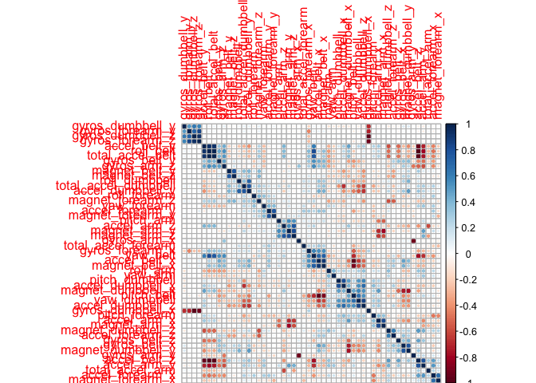
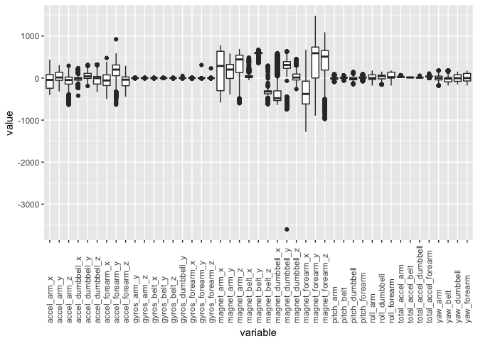
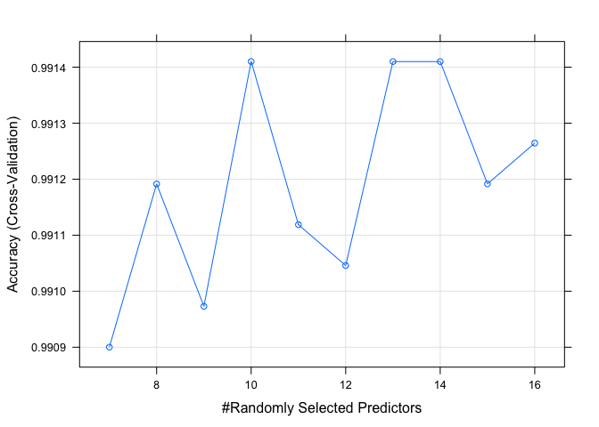

### Introduction

This assignment of the Practical Machine Learning course involves analysis of Human Activity Recognition data on the quality of performing cumbbell curls. Six young participants were asked to perform one set of 10 repetitions of the Unilateral Dumbbell Biceps Curl in five different fashions: class A: exactly according to the specification, class B: throwing the elbows to the front, class C: lifting the dumbbell only halfway, class D: lowering the dumbbell only halfway, class E: throwing the hips to the front. 4 sensors were used to measure each activity (belt, dumbbell, arm and forearm)

### Project

The goal of the project is to predict the manner in which the exercise was done Data was collected and divided into a training and a testing dataset. Describe and motivate - how the model was built - how cross validation was used - what the expected out of sample error is Also predict the outcome of the 20 test cases in the testing set

Load necessary libraries:

``` r
library(ggplot2)
library(dplyr)
library(caret)
library(corrplot)
library(tidyr)
```

Load training and testing datasets in R:

``` r
#set working directory to appropriate directory with downloaded files using setwd()
setwd("~/coursera/8 Practical machine learning/assignment")
trainingall <- read.csv("pml-training.csv")
testingall <- read.csv("pml-testing.csv")
```

Explore datasets and preprocess/prepare for analysis:

``` r
dim(trainingall)
```

    ## [1] 19622   160

``` r
dim(testingall)
```

    ## [1]  20 160

``` r
#identify and remove columns with all NA in testing from both datasets
naCols <- colSums(is.na(testingall)) == 20
#also remove columns not essential for model building (X, user_name, ..timestamp.. and ..window)
noCols <- c(1,2,3,4,5,6,7)
testing <- testingall[,!naCols][,-noCols]
training <- trainingall[,!naCols][,-noCols]
```

The training and testing datasets contains 19622 and 20 samples respectively which are described by 159 predictors and the outcome (class/problem\_id). 100 predictors in the testing set contain no data (NA) and will be excluded from model building and prediction efforts. Also remove unnecessary columns from dataset.

Remove highly correlated columns from the dataset as well:

``` r
corrplot(cor(training[,-53]),order="hclust")
```



``` r
prep <- preProcess(training, method="corr")
training <- predict(prep, training)
testing <- predict(prep, testing)

#highly correlated columns removed:
prep$method$remove
```

    ## [1] "accel_belt_z"     "roll_belt"        "accel_belt_y"    
    ## [4] "accel_belt_x"     "gyros_dumbbell_x" "gyros_dumbbell_z"
    ## [7] "gyros_arm_x"

Check for obvious outlier samples:

``` r
traininglong <- gather(training, variable, value, -classe)
ggplot(traininglong, aes(x = variable, y = value)) + geom_boxplot() +
  theme(axis.text.x=element_text(angle=90,hjust=0, vjust=0.5))
```



Remove onle the one sample where the magnet\_dumbbell\_y value is clearly an outlier and probably a faulty readout.

``` r
training <- training[!training$magnet_dumbbell_y < -3000,]
```

Split training data to sub - training and testing sets for cross validation and assessment of out of sample error.

``` r
inTrain <- createDataPartition(y=training$classe, p=0.7, list=F)
subtraining <- training[inTrain,]
subtesting <- training[-inTrain,]
```

#### Fit a model

Now determine a model fit to the data using rf and gbm with or without PCA preprocessing and see what's best. I performed a comparison of the Boosting and Random Forest classification methods (gbm and rf resp.) with or withoot PCA processing (data not shown). Random Forest without PCA preprocessing was selected based on best out of sample error.

``` r
set.seed(531)
modelFit <- train(classe ~ ., method = "rf", data= subtraining, trControl = trainControl(method="cv", number=4))

modelFit
```

    ## Random Forest 
    ## 
    ## 13737 samples
    ##    45 predictor
    ##     5 classes: 'A', 'B', 'C', 'D', 'E' 
    ## 
    ## No pre-processing
    ## Resampling: Cross-Validated (4 fold) 
    ## Summary of sample sizes: 10302, 10303, 10303, 10303 
    ## Resampling results across tuning parameters:
    ## 
    ##   mtry  Accuracy   Kappa    
    ##    2    0.9886440  0.9856334
    ##   23    0.9901726  0.9875683
    ##   45    0.9783071  0.9725545
    ## 
    ## Accuracy was used to select the optimal model using  the largest value.
    ## The final value used for the model was mtry = 23.

``` r
pred <- predict(modelFit, newdata = subtesting)
cM <- confusionMatrix(subtesting$classe, pred)
cM
```

    ## Confusion Matrix and Statistics
    ## 
    ##           Reference
    ## Prediction    A    B    C    D    E
    ##          A 1671    2    0    0    1
    ##          B    7 1127    3    0    1
    ##          C    0    3 1020    3    0
    ##          D    0    0   20  942    2
    ##          E    0    0    2    4 1076
    ## 
    ## Overall Statistics
    ##                                          
    ##                Accuracy : 0.9918         
    ##                  95% CI : (0.9892, 0.994)
    ##     No Information Rate : 0.2852         
    ##     P-Value [Acc > NIR] : < 2.2e-16      
    ##                                          
    ##                   Kappa : 0.9897         
    ##  Mcnemar's Test P-Value : NA             
    ## 
    ## Statistics by Class:
    ## 
    ##                      Class: A Class: B Class: C Class: D Class: E
    ## Sensitivity            0.9958   0.9956   0.9761   0.9926   0.9963
    ## Specificity            0.9993   0.9977   0.9988   0.9955   0.9988
    ## Pos Pred Value         0.9982   0.9903   0.9942   0.9772   0.9945
    ## Neg Pred Value         0.9983   0.9989   0.9949   0.9986   0.9992
    ## Prevalence             0.2852   0.1924   0.1776   0.1613   0.1835
    ## Detection Rate         0.2840   0.1915   0.1734   0.1601   0.1829
    ## Detection Prevalence   0.2845   0.1934   0.1744   0.1638   0.1839
    ## Balanced Accuracy      0.9976   0.9966   0.9874   0.9941   0.9975

This Random Forest model, using resampling method "cv" , 4 resampling iterations and using 23 variables for each split (mtry), achieves an accuracy on the subtesting / validation set of 0.9918423. This translates to an expected out of sample error of 1-0.9918423 = 0.8157716 %.

### Model tuning

Additional model tuning was done within the caret train function. The parameter mtry, the number of variables randomly sampled as candidates at each split, was optimized first.

``` r
modelFit2 <- train(classe ~ ., method = "rf", data= subtraining, 
                    trControl = trainControl(method="cv", number=4),
                    tuneGrid=expand.grid(.mtry=c(7:16)), ntree=500)
```

``` r
plot(modelFit2)
```



``` r
pred <- predict(modelFit2, newdata = subtesting)
cM2 <- confusionMatrix(subtesting$classe, pred)
cM2
```

    ## Confusion Matrix and Statistics
    ## 
    ##           Reference
    ## Prediction    A    B    C    D    E
    ##          A 1671    2    0    0    1
    ##          B    6 1131    1    0    0
    ##          C    0    3 1020    3    0
    ##          D    0    0   16  946    2
    ##          E    0    0    2    4 1076
    ## 
    ## Overall Statistics
    ##                                           
    ##                Accuracy : 0.9932          
    ##                  95% CI : (0.9908, 0.9951)
    ##     No Information Rate : 0.285           
    ##     P-Value [Acc > NIR] : < 2.2e-16       
    ##                                           
    ##                   Kappa : 0.9914          
    ##  Mcnemar's Test P-Value : NA              
    ## 
    ## Statistics by Class:
    ## 
    ##                      Class: A Class: B Class: C Class: D Class: E
    ## Sensitivity            0.9964   0.9956   0.9817   0.9927   0.9972
    ## Specificity            0.9993   0.9985   0.9988   0.9963   0.9988
    ## Pos Pred Value         0.9982   0.9938   0.9942   0.9813   0.9945
    ## Neg Pred Value         0.9986   0.9989   0.9961   0.9986   0.9994
    ## Prevalence             0.2850   0.1931   0.1766   0.1620   0.1834
    ## Detection Rate         0.2840   0.1922   0.1734   0.1608   0.1829
    ## Detection Prevalence   0.2845   0.1934   0.1744   0.1638   0.1839
    ## Balanced Accuracy      0.9979   0.9971   0.9902   0.9945   0.9980

Tuning of mtry shows optimum performance at mtry=10 and also increased the prediction accuracy on the subtesting validation set to 0.9932019.

Allthough a very marginal gain of performance it was a good exercise in understanding the tuning within train(). As the out of sample error is very low already further tuning is not necessary.

### Prediction

Finally predict the outcome for the 20 test cases using the optimised Random Forest model.

``` r
predict(modelFit2, newdata = testing)
```

    ##  [1] B A B A A E D B A A B C B A E E A B B B
    ## Levels: A B C D E
